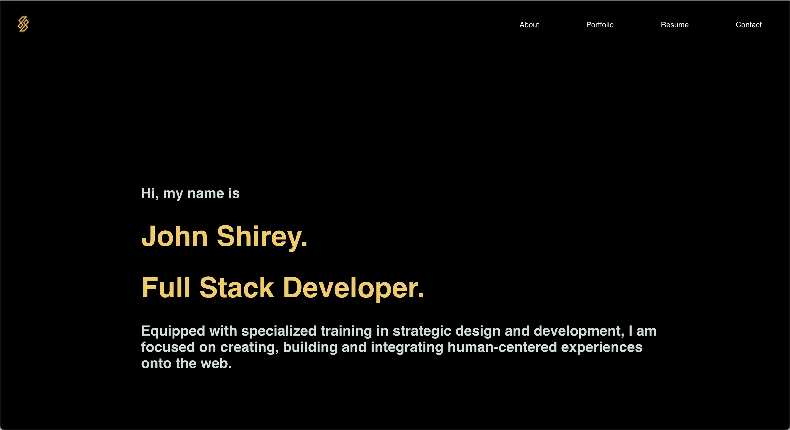

# React Portfolio

## Description
This project is version 2 of my personal portfolio made 100% with React.

## Table of Contents
* [Usage](#usage)
* [Contributing](#contributing)
* [Tests](#tests)
* [Questions](#questions)
* [Screenshot](#screenshot)
* [Deployment](#deployment)

## Usage
For displaying my skills of software development, my projects and my resume.

## Contributing
Contributions are not accepted. Thank you.

## Tests
Run npm start and the portfolio will load in the browser.

## Questions
If you have any questions, please contact me at jayshirey@gmail.com	 or visit my [GitHub profile](https://github.com/jpshirey5).

## Screenshot

## Deployment
https://jpshirey5.github.io/portfolio_v2/